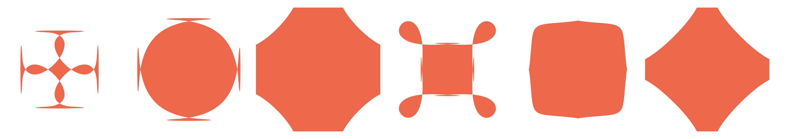

# Bubbly Buttons
Bored of normal border-radius?

Want to give your elements some curves?

Here's a simple way to generate a more joyful box.


Check out the [demo](https://codepen.io/jcbsn/pen/wvKEXJb) at codepen.

## Inspiration
I was one day scrolling through the feed of dribbble looking for inspiration. Suddenly, these funky looking buttons appeared. They weren't normal buttons. They had a border radius, and they had something more, something really fancy. This left me wondering if I can make them myself using CSS. Challange accepted!

After doing some research I found that I couldn't make them with CSS. Atleast not according to my understanding. 

SVG Paths seemed to be a promising workaround. Please let me know if there is another way.

## The Prototype
I would like to give a huge thanks to Anthony Dugois for making the [SVG Path Builder](https://codepen.io/anthonydugois/pen/mewdyZ).
I find myself using the tool as a creative outlet from time to time.

Using the tool I got something to start working with. Time to get technical.


Just copying the path from the tool and pasting it in an SVG is easy. 
But what if we want it to be a rectangle instead of a square? What if we aren't happy with the radius? What if we want it more "bubbly"?
Scaling it could work, but then distortion kicks in. Can't have that. Not sustainable. 

I started thinking about making a tool to generate these for me. That would ease the process a bit. 
Maybe some fancy sliders to adjust everything real-time. I then realised I still hadn't gotten away from copy/paste.

Things had to get automated.

## The script
It resulted in a script you easily can import to your projects.
You don't even need to write SVG. 

1. Add the script, preferably at the bottom of the `body`.
```html
<script src="/javascript/bubbly-b.js" type="text/javascript"></script>
```
The script can be found [here](scripts/bubbly-b.js). There's also a [minimized](scripts/min.bubbly-b.js) version (1.81 KB).

2. Add an element with the class `bubbly-b`. This can be on an anchor tag, a div or whatever you want.

3. Add some styling to fit your own needs.


## HTML
```html
<a href="#" class="bubbly-b">I'm Bubbly!</a>
```
...and the script generates something like:
```html
<a href="#" class="bubbly-b" style="width: 143px; height: 72px;">
  I'm bubbly!
  <svg width="143" height="72">
     <path d="M 4 16 C 6 8 8 6 16 4 C 24 2 119 2 127 4 C 135 6 137 8 139 16 C 141 24 141 48 139 56 C 137 64 135 66 127 68 C 119 70 24 70 16 68 C 8 66 6 64 4 56 C 2 48 2 24 4 16 ">
     </path>
  </svg>
</a>
```

In this example I've used an anchor tag with some text. If you want to override the automatic behaviour, have a look at the parameters below.

There are a few parameters that can be adjusted:
Go play around with them in the [demo](https://codepen.io/jcbsn/pen/wvKEXJb).

1. Width, changes the width.

2. Height, changes the height.

3. Radius is pretty straight forward. There's a default of 1/6th of the lesser of width and height.

4. Offset is there to accomodate for SVG and the overflow cutting off.

5. Angle modifies the cubic-bezier part of the SVG Paths. When the other parameters are "normal" this one behaves. 

All of these are automatically set if left out or empty.

The HTML looks like this:
```html
<a href="#" class="bubbly-b"
   width=""
   height=""
   radius=""
   offset=""
   angle=""
   ></a>
```
If you want defaults other than the ones set, it's easily changed in the script.

I cannot be held accountable for what happens when parameters are abused. 
It wasn't my intention, buy you can make some funky looking shapes with this.



## CSS

These are the essential styles needed to make this work. 

```css
* {
	box-sizing: border-box;
}

.bubbly-b {
	display: inline-block;
	position: relative;
}
.bubbly-b svg {
	position: absolute;
	top: 0;
	left: 0;
	z-index: -1;
}
```

Since box-shadow works poorly with these shapes, add this to the `.bubbly-b` style.

```css
filter: drop-shadow(rgba(0,0,0,.4) 0 5px 8px);
```

## Conclusions
It's been a fun day.
If you have any thoughts or suggestions, please let me know.

Feel free to use this in your projects.
If you decide to use it, please send me a link.

You can find me at [@philip_jcbsn](https://twitter.com/philip_jcbsn) on Twitter.

Take care!
/Philip
